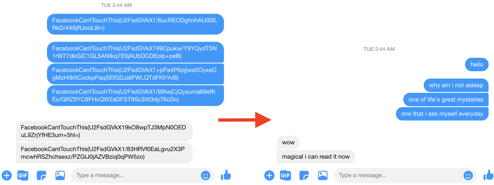

# Encrypt Facebook Messenger - Chrome Extension

This extension will encrypt and decrypt your messages **locally** in the browser (using AES encryption via [CryptoJS](https://github.com/brix/crypto-js)) so that no plain text is sent over the network to Facebook servers.

## Background

After reading [this article](https://www.nytimes.com/2020/01/24/opinion/sunday/surveillance-capitalism.html), I was motivated to build something
that would help resist the forces of [surveillance capitalism](https://en.wikipedia.org/wiki/Surveillance_capitalism).

N.B. This extension is _not_ intended to be a fully-functioning tool for encrypted messaging ([Signal](https://signal.org/) and [Telegram](https://telegram.org/) are much better for that). Rather, it was built as a proof of concept, an **act of resistance**, and (hopefully) a source of inspiration.

## Installing the extension

Because the extension is unpublished (for now), you have to jump through some hoops to install it.

- Download this repo
- Open Chrome
- Go to [chrome://extensions](chrome://extensions)
- Turn on "Developer Mode" in the top right corner
- Click "Load unpacked"
- Navigate to and select the "Source" folder

## Setup

- Click on the "E" icon in your toolbar
- Click "Options"
- For each friend/group who also has the extension, type in the conversation ID and a previously-agreed-upon secret passphrase
  - Conversation IDs can be found in the address bar when you are in a conversation with someone: `https://messenger.com/t/[id]`
- Click "Save"
- You will need to refresh messenger.com whenever you update your secret passphrases

## Usage

Just go to messenger.com and use it as normal! (although for now, in order to encrypt messages you have to **send by pressing "Enter"**; clicking the little paper plane will instead send the message unencrypted).

Only conversations for which you have set a passphrase in "Options" will be encrypted (other conversations will continue to work unencrypted as normal).

Note that **only text messages** (i.e. not images, stickers, reactions, gifs) are encrypted for now.

## TODO

- facebook.com support
- change message color if encrypted (option)
- attempt to warn if extension no longer working due to FB code changes
- make click send button work (in addition to pressing enter)
- handle images
- handle gifs, stickers
- handle reactions
- handle multi-line messages more elegantly
